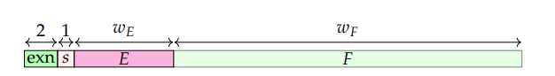

# Clash Library Support for Floating Point Numbers with FloPoCo

This library provides Clash support for floating-point numbers as used by FloPoCo. It relies on **hmpfr** version 0.4.5, which is the Haskell binding library for **MPFR**—the same floating-point library used by FloPoCo. The support version of FloPoCo is 5.0
## Explaination
The FloPoCo has its own custom floating-point known as Nfloat. This Nfloat is the IEEE floating point with 2 extra extension bits for 4 cases: zero, Nan, Infinity and normal number.
The bits fields of Nfloat is represent like this:

|Exn | Meaning |
|--- |---- |
|00  | Zero (bot +0 and -0)|
|01  |Normal number|
|10  | Infinity (both + Infinity and - Infinity) |
|11 | NaN (Not a number)|

## Example usage
The Nfloat of FloPoCo is defined as FoFloat in this library. FoFloat is implemented as BitVector for the sake of hardware synthesis.
```haskell
newtype FoFloat (wE::Nat ) (wF::Nat) (rndMode:: M.RoundMode) = FoFloat{unFoFloat::BitVector(1 + 2 + wE + wF)}
    deriving(Generic, Typeable, Show, BitPack, Eq, NFDataX, ShowX, Lift)
```
Users can declare their own floating point type for simple usage:
```haskell
import qualified Data.Number.MPFR as M
type MyFloat = FoFloat 8 23 M.Near
```
To see the example, please look at the Example.hs file in the src folder.
## Current issue
Currently, there is a linking error with the shared MPFR library when user uses the lift instance in the FoFloat type. This will cause the build error.  For example, this will cause build error:
```haskell
ta = $(lift (1.2 :: FoFloat 4 11 M.Near))
```
However, if users run ghci and then load the Haskell file containing the usage of the lift instance with FoFloat type, it will not create any error. Therefore, a temporary solution for users who like to use Clash testbench framework with FoFloat is to load the that Haskell file in the clashi environment. Users can run clashi via the command
```bash
cabal run -- clashi -fclash-clear
```

## Compatibility Note

Currently, this library has been tested with **GHC 9.8.2** on Window, and **GHC 9.10.1** on Ubuntu Linux. To use this library on Window, user must ensure that **MPFR** and **GMP** libraries are built with **Clang**, because the GHC on Window use **Clang** starting from **GHC 9.4.4** and above. This is not the case on Ubuntu Linux.
The easiest way to install MPFR library on Window is to use msys2:  
```
pacman -S mingw-w64-clang-x86_64-mpfr
```

## Key Changes in hmpfr library source code

1. Add `Prelude` to every Haskell file.
2. Define `type Exp` as `CLong`.
3. Add support rounding mode FaithFul

